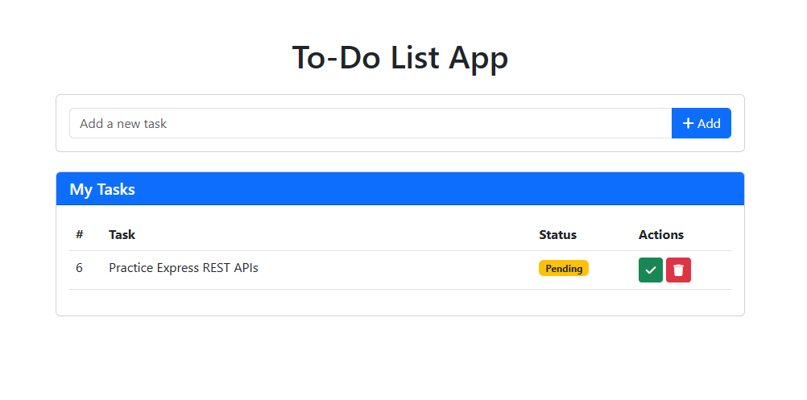

# Express To-Do List Application

A full-stack To-Do List application built with Express.js, MySQL, and vanilla JavaScript that allows users to create, read, update, and delete tasks.

## Features

- Create new tasks
- View a list of all tasks
- Mark tasks as completed
- Delete tasks
- Responsive design with Bootstrap

## Technologies Used

- **Backend**: Node.js, Express.js
- **Database**: MySQL
- **Frontend**: HTML, CSS, JavaScript
- **UI Framework**: Bootstrap 5
- **Icons**: Font Awesome

## Installation

1. Clone the repository:
   ```
   git clone https://github.com/PasinduOG/express-api-mysql.git
   cd express-api-mysql
   ```

2. Install dependencies:
   ```
   npm install
   ```

3. Configure MySQL database:
   - Make sure MySQL server is running
   - Update database configuration in `routes/task.auth.js` if needed:
     ```javascript
     const db = mysql.createConnection({
         host: 'localhost',
         user: 'root',
         password: 'your-password',
         database: 'todo_app'
     });
     ```

4. Start the server:
   ```
   npm run dev
   ```

5. Access the application at:
   ```
   http://localhost:5000
   ```

## Usage

1. **Add a task**: Type a task title in the input field and click the "Add" button
2. **Complete a task**: Click the green checkmark button next to a task
3. **Delete a task**: Click the red trash icon button next to a task

## API Endpoints

| Method | Endpoint                | Description                 |
|--------|-------------------------|-----------------------------|
| GET    | /api/tasks              | Get all tasks               |
| POST   | /api/tasks              | Create a new task           |
| PUT    | /api/tasks/:id/complete | Mark a task as completed    |
| DELETE | /api/tasks/:id          | Delete a task               |

## Database Structure

The application uses a MySQL database with a single table:

```sql
CREATE TABLE tasks (
    id INT AUTO_INCREMENT PRIMARY KEY,
    title VARCHAR(255) NOT NULL,
    status ENUM('Pending', 'Completed') DEFAULT 'Pending',
    created_at TIMESTAMP DEFAULT CURRENT_TIMESTAMP
)
```

## Screenshots


*Note: Replace with actual screenshots of your application*

## License

MIT
